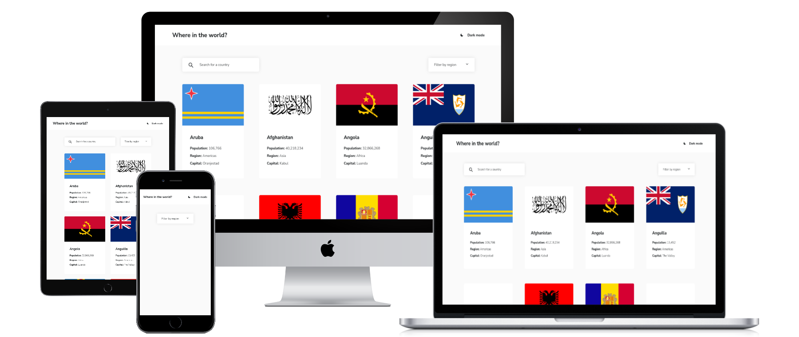

# Where in the world? - Frontend Mentor Challenge

Developer: Robin Bosch  
Designed by Frontend Mentor

[View live Site](https://where-in-the-world-frontend-mentor-seven.vercel.app/)  

## Table of contents

- [Overview](#overview)
    - [The challenge](#the-challenge)
    - [Designs](#designs)
- [My process](#my-process)
    - [Challenges](#challenges)
    - [What I learned](#what-i-learned)
- [Technologies used](#technologies-used)
    - [Languages](#languages)
    - [Frameworks used](#frameworks-used)
- [Validation and Testing](#validation-and-testing)
- [Author](#author)
- [Credits](#author)
- [Acknowledgments](#acknowledgments)
- [License](#license)

## Overview

### The challenge

Your users should be able to:

- See all countries from the API on the homepage
- Search for a country using an `input` field
- Filter countries by region
- Click on a country to see more detailed information on a separate page
- Click through to the border countries on the detail page
- Toggle the color scheme between light and dark mode

### Designs

The following designs were given to build the project:  

The Desktop design with a shown width of 1440px (dark mode)

The Desktop design with a shown width of 1440px (light mode)

The Desktop detail page design (dark mode)

The Desktop detail page design (light mode)

The Mobile design with a shown width of 375px (dark mode)

The Mobile design with a shown width of 375px (white mode)

The Mobile detail page design (dark mode)

The Mobile detail page design (white mode)

## My process

### Challenges

- Making the app relatively efficient as the API for the countries is very slow.
- Improving first load as displaying all countries makes the app slow.
- Keeping the state consistent between the search results, the region sort and without filters.
- Reducing server and client load

### What I learned

- Using the new app router of NextJS
- Using API routes in NextJS directly
- First time creating a custom select, very easy to make
- There is definitely room for improvement in terms of chaching, reducing the server load and improving the client speed.

## Technologies used

### Languages

- HTML
- CSS
- Typescript

### Frameworks used

- NextJS (App router)
- React Icons

## Validation and Testing

### HTML Validation

HTML validation was done with the [W3 HTML validator](https://validator.w3.org/nu/) and came back with a few warnings for the trailing backslash in meta tags.

### CSS Validation

CSS validation was done with the [W3 CSS validator](https://jigsaw.w3.org/css-validator/) and came back with an error for the google fonts.

### Accessibility Testing

Accessibility was checked with the browser extension of the [WAVE validator](https://wave.webaim.org/) and came back with no errors.

### Device Testing

The website was tested on the following devices:

- Windows 11 PC (Screen resolution: 2560x1440)
- Xiaomi MI 9 with Android 11 (Screen resolution: 1080x2280)
- Xiaomi Pad 6 with Android 12 (Screen resolution: 1800x2880)

Other screen resolutions were tested in the browser with dev tools from 2560x1440 down to 320x568.

### Useful resources

Two helpful reference guides I use: 
- [Grid Guide](https://css-tricks.com/snippets/css/complete-guide-grid/)
- [Flexbox Guide](https://css-tricks.com/snippets/css/a-guide-to-flexbox/)

## Credits

- [Frontend mentor](https://www.frontendmentor.io) - For providing me with [this challenge and the designs.](https://www.frontendmentor.io/challenges/rest-countries-api-with-color-theme-switcher-5cacc469fec04111f7b848ca) 
- [Reset CSS](https://andy-bell.co.uk/a-modern-css-reset/) from Andy Bell
- [The list of the countries](https://restcountries.com/) from the REST countries repository

## License

This project is published under the MIT license.  
The challenge itself is excluded from this license.  
[License](/LICENSE.txt)
